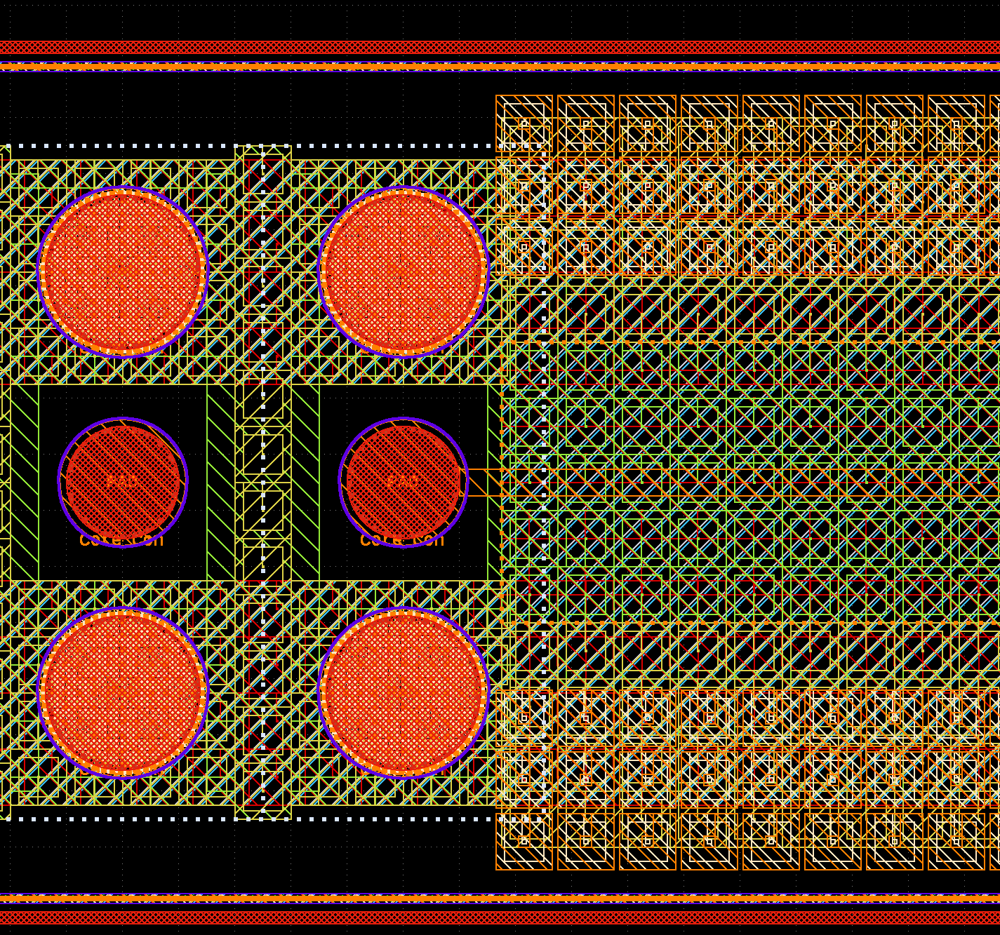
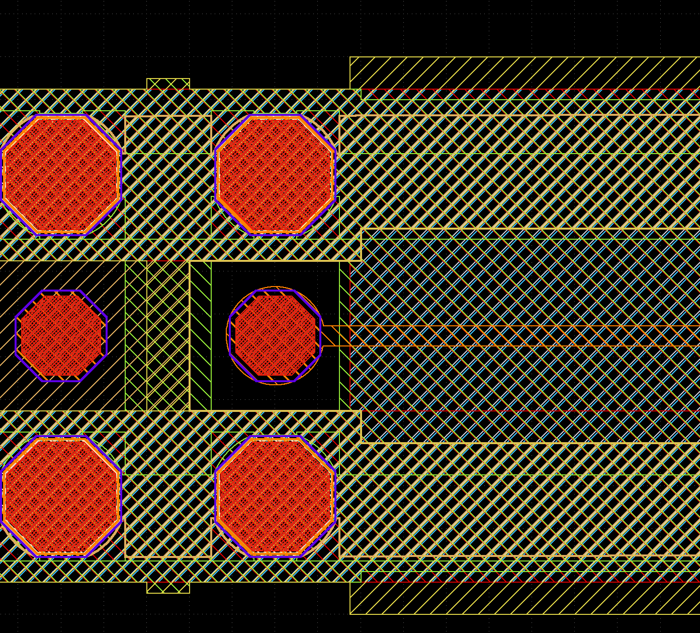

# Prepare IHP SG13G2 GDSII layout for EM simulation

This is a collection of tools to simplify GDSII layout for EM simulation.

Layouts are usually simple and clean in the initial design phase, but simulating  a „final“ layout that was already prepared for tape-out with density rules etc. can be a challenge.
The picture below shows some typical challenges:

[](initial gds)

1) To fulfill metal density rules, larger areas have been created as an array of squares with hole inside. This hole does not really matter for EM results, but it will lead to additional mesh cells and slow down mesh generation and simulation.
For openEMS, the value of refined_cellsize can efficiently be used to skip small detail, but still those edges will slow down the meshing processing. For Palace, such small detail will all be included in mesh and it is absolutely required to remove this.
2) On layer TopMetal2 shown as orange boxes on the top right side, and many other layers hidden here, the layout includes unconnected (floating) metal boxes that are used to fulfill density rules. Unlike auto-generated dummy metal fill, this man-made dummy metal fill is on purpose „drawing“ and can’t be skipped by the purpose (data type).
3) Especially for pads, there is a massive amount of vias located in via arrays at rather large spacing. We can’t simplify increase the distance for via array merging in the gds2palace or gds2openEMS scripts, because that is a global setting and might also create unintentional short between adjacent via stacks.
4) In the case shown here, the pads for copper pillar are round, which is represented in GDSII as a polygon with many vertices, resulting in over-meshing at these polygons, wasting simulation time.

To solve these issues and create a more simulation-friendly layout, a collection of tools is provided here.

## gds_removefill
This tool will check for unconnected (floating) metal fill on purpose drawing, and remove this. By default, the size limit for removing these floating polygons is 1 to 40 microns.

## gds_simplify
This tool will check for metals with square shape and square hole inside, which are typical for man-made tweaks to fulfill metal density rules. These polygons are replaced by solid squares with no hole. Also, the tool will check for circle-like polygons, and replace them by an octagon, which is more effiently simulated in the gds2palace workflow.

## gds_prepare_for_EM
This all-in-one tool will combine multiple preprocessing steps:
- STEP 1: remove cutouts in the hierachical design, don't flatten at this stage. Do this on metal layers (not via layers, not EM port layers)
- STEP 2: via array merging, this also flattens the design hierarchy
- STEP 3: remove floating metals that are not connected to anything, with size in a range
- STEP 4: replace circle-like polygons (from metal or result of via array merging) by octagons

Starting from the example above, the resulting cleaned and simplified GDSII then looks like this:

[](cleaned gds)


# Usage
Ro run the tools, specify the *.gds filename as commandline parameter. The cleaned file will then be save with appropriate file suffix. 

example:
```
python gds_prepare_for_EM.py layout.gds
```

# Prerequisites
The code requires Python3 and these libraries, install using pip install libraryname
- gdspy
- rtree
- numpy


